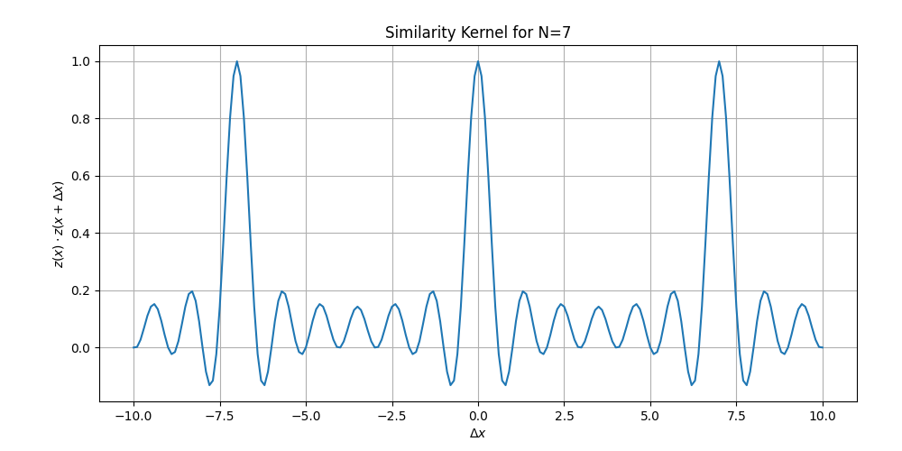

# Residue-Number-System
Residue numbers system applications and implementation in neuroscience. High-dimensional computing, spatial navigation... 
## HD-Residue-Number-Representation

### Overview
This repository implements high-dimensional (HD) representations for residue numbers using modular arithmetic on the unit circle, derived from the roots of unity. The approach is inspired by recent research (Kymn C. et al., 2023) and provides an efficient method for encoding cyclic data in high-dimensional space.

### Features
- High-dimensional representation for residue numbers
- Similarity kernel computation for modular comparisons
- Visualization of similarity structure based on residue computations

### Example
The similarity kernel plot shows the periodic similarity pattern of high-dimensional residue representations.

1. **Phasor Distribution (Roots of Unity)**: With \( N = 7 \), the phasors are evenly spaced on the unit circle. Each phasor can be represented as:

   $$
   z = 
   \begin{bmatrix}
   e^{j \theta_0} \\
   e^{j \theta_2} \\
   \vdots \\
   e^{j \theta_6} 
   \end{bmatrix}
   $$

   where \( \theta_k = \frac{2\pi k}{7} \) for \( k = 0, 1, 2, \dots, 6 \).

2. **Definition of \( z(x) \)**: For a given integer \( x \), the vector \( z(x) \) scales each phase angle by \( x \):

   $$
   z(x) = 
   \begin{bmatrix}
   e^{j \theta_0 x} \\
   e^{j \theta_2 x} \\
   \vdots \\
   e^{j \theta_6 x}
   \end{bmatrix}
   $$

3. **Similarity Kernel \( z(x) \cdot z(x + \Delta x) \)**: We then calculate the inner product of \( z(x) \) and \( z(x + \Delta x) \) for various values of \( \Delta x \) to observe the periodicity and similarity structure. The result is:

   $$
   \text{Similarity}(x, x + \Delta x) = z(x) \cdot z(x + \Delta x)
   $$

